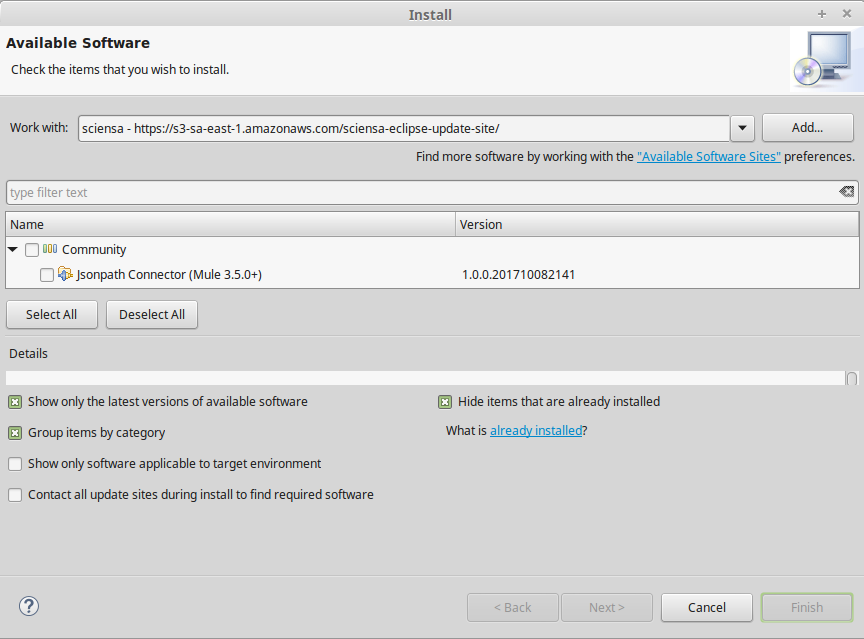
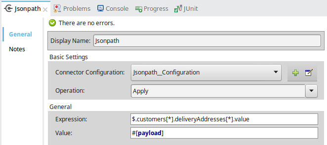
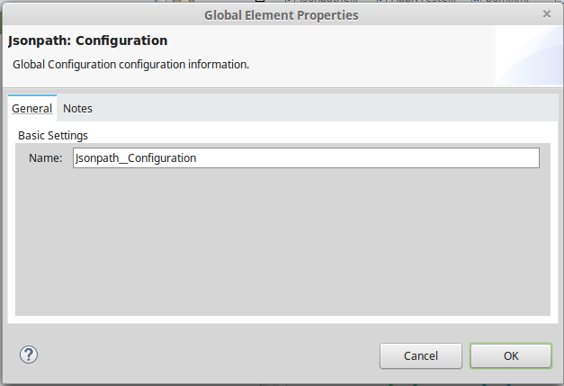
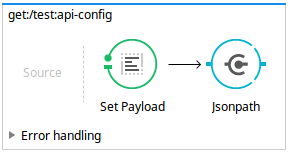

# Jsonpath Anypoint Connector

[Connector description including destination service or application with]

# Mule supported versions
Examples:
Mule 3.4.x, 3.5.x
Mule 3.4.1

# Installation 

## Sciensa Eclipse Update Site

https://s3-sa-east-1.amazonaws.com/sciensa-eclipse-update-site/

In case of error while installing, **Uncheck** the Option *Contact all update sites during install to find required software*

## Other Alternatives
For beta connectors you can download the source code and build it with devkit to find it available on your local repository. Then you can add it to Studio

For released connectors you can download them from the update site in Anypoint Studio. 
Open Anypoint Studio, go to Help → Install New Software and select Anypoint Connectors Update Site where you’ll find all avaliable connectors.

# Usage

## Configuration

## Flow

# Reporting Issues

We use GitHub:Issues for tracking issues with this connector. You can report new issues at this link http://github.com/wellingtonmoreira/mule-jsonpath-connector/issues.
